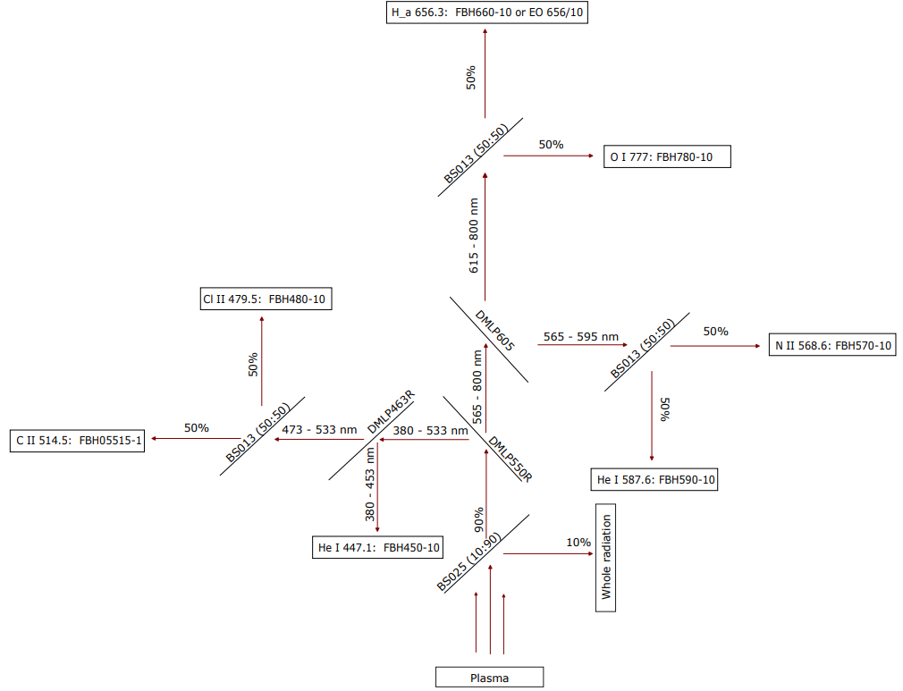
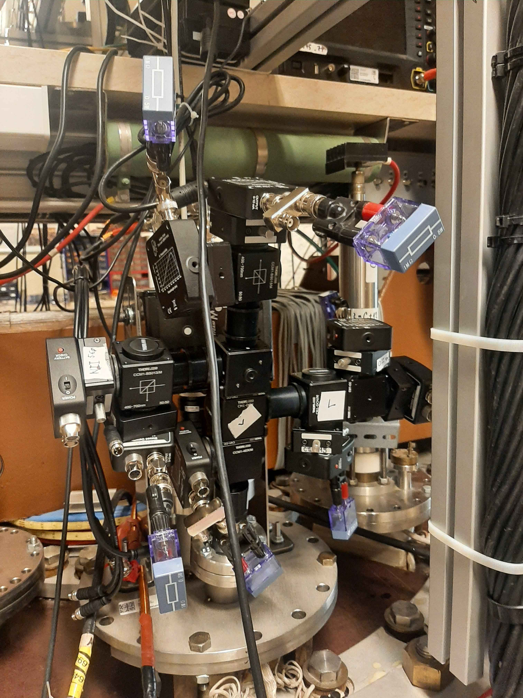
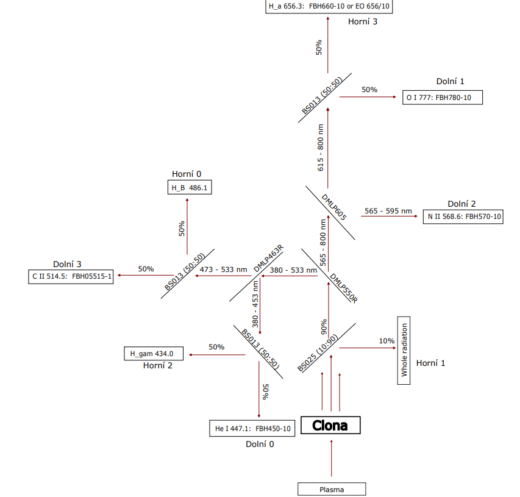

---
format:markdown
...

# Josef Tuček, Samuel Stanek - Spectroscopic analysis of spontaneous transport barriers with high time resolution

## Goals

(motivace, rešerše, teorie, experimentální uspořádání, záměr, a časový plán)

### Motivation

Spontaneous transport barriers have been previously detected at the GOLEM tokamak in helium discharges. A possible cause of spontaneous transport barrier formation is the presence of various impurities such as nitrogen, carbon and metals. [1]

To detect how the composition of select impurities changes before and during the formation of the transport barrier, a spectrometer system with high temporal resolution is needed.

### Previous state

The tokamak already features a fast spectrometer, which is composed of beam splitters, spectral filters and free-space biased detectors. It can bee seen in the image below.

<!-- TODO: Image -->

### Dichroic mirrors

Dichroic mirror is an optical element that reflects light with wavelength smaller than a certain cutoff wavelength and transmits light with higher wavelength. They will be used in the new version of the fast spectrometer to split the incoming radiation towards multiple detectors without losing intensity in the relevant wavelength ranges.

### Plan

In this work, the following tasks are planned:

1. Choose, which wavelengths to study, to better understand transition barriers in GOLEM.
2. Design the spectrometer to measure these wavelengths.
3. Compute the quantum efficiency for radiation hitting each detector.
4. Order the needed part from Thorlabs.
5. Assemble the spectrometer according to the proposed design and attach it to the tokamak.
6. Take measurements of multiple He discharges, where a transport barrier occurs.
7. Analyze the collected data, verify its correctness and compare to other methods of spectrum measurement (fast cameras and slow spectrometers).

### Proposed fast spectrometer configuration

The proposed configuration is illustrated in the figure below. In this setup, 10% of the total radiant intensity is extracted as a reference. 
The remaining radiation is subsequently partitioned into specific wavelength regions by means of 
dichroic mirrors. Utilizing beam splitters and optical filters, the radiant intensity of individual spectral lines can then be measured. For better reference, code names of used optical parts 
are included in the figure.  

## Logbook

### Spectral line choice (19.10.2025)

Initially, it was necessary to select specific spectral lines for which the temporal evolution of intensities was to be measured. Based on a comparison of historical helium discharges (shots) on the GOLEM tokamak, the most prominent lines were identified. These lines were selected to align with the research objective of investigating the formation of transport barriers in helium in greater detail. Furthermore, it was essential to select spectral lines sufficiently isolated from neighboring features to prevent spectral overlap and ensure the accuracy of the measured radiant intensity. Following a rigorous analysis, the following spectral lines were selected:

- He I 447.1 nm
- Cl II 479.5 nm
- C II 514.5 nm
- N II 568.6 nm
- He I 587.6 nm
- H&alpha; 656.3 nm
- O I 777.0 nm 

### Assembled first version with dichroic mirrors (29.10.2025)
A first-generation prototype of the spectroscope was assembled utilizing existing optical components. The spectrometer configuration incorporated filters for the measurement of four specific spectral lines: H&alpha;, H&beta;, He I 468 nm, and C II 514.5 nm. In order to complete the assembly of the planned spectrometer, the purchase of additional optical elements was required.

### Parts selected for purchase (1.11.2025)

In addition to optical filters, dichroic mirrors, and the supporting infrastructure for the optical components, new DET100A2 photodiodes from Thorlabs were procured. These are intended to replace the existing detectors to provide a higher output signal. To calculate the bandwidth of these diodes, the following formula was employed:

$$f_{BW} = \frac{1}{2\pi R_{LOAD} \times C_j}$$

$f_{BW}$ ss the bandwidth measured in Hz. This represents the maximum frequency at which the photodiode can accurately follow the modulation of the light.
$R_{LOAD}$ stands for the load resistance. It's the resistance of the circuit connected to the photodiode. A larger resistor produces a larger voltage signal but slows down the response time.
$C_j$ is the junction capacitance. This is an internal property of the photodiode. 

To achieve the necessary bandwidth and satisfy the Nyquist criterion for measuring phenomena at frequencies up to 50 kHz (while avoiding aliasing), $10\text{ k}\Omega$ resistors were initially selected. However, it was subsequently determined that although these resistors optimized the temporal response of the photodiode, the resulting output signal amplitude was insufficient for reliable detection. Consequently, alternative load resistances of $1\text{ M}\Omega$, $250\text{ k}\Omega$, and $100\text{ k}\Omega$ were evaluated. Ultimately, the $1\text{ M}\Omega$ resistors were selected to provide an adequate signal-to-noise ratio.

### Assembly of full spectroscope (26.11.2025)
The spectroscope was assambled and prepared for future testing.

  

### Scan of multiple resistor values (3.12.2025)
As already mentioned, the tests to determine the ideal load resistance were carried out. The test shots are listed below.

- #50737: $1\text{ M}\Omega$
- #50738: $250\text{ k}\Omega$
- #50739: $100\text{ k}\Omega$
- #50740: $10\text{ k}\Omega$
- #50741: $1\text{ M}\Omega$

### Reconfigure for H discharges (10.12.2025 and 16.12.2025)
The initial optical configuration underwent minor modifications to optimize detection during hydrogen (H) discharges. An aperture stop was integrated into the system to further refine the beam geometry. The current layout, representing the most recent iteration as of January 4, 2026, is illustrated in the figure below. 

Note: The annotations above and below the filter designations indicate the specific oscilloscope channel to which the corresponding photodiode is interfaced. 

## Concluding report 

The final presentation and report will be added later.

## What to do in the future? (for future students)

1. Increase signal intensity / decrease interference
2. Increase the detection sensitivity
3. Restrict the field of view
4. We could just get rid of the splitters, doubling the sensitivity
5. Compare measurements from fast cameras, slow spectrometers and fast spectrometer
6. Assemble fast spectrometer fo He plasmas
7. Explore why Whole and He line doesn't agreee slow spectrometer

## Bibliography

<!-- Pozn: na Golem wiki musí být k dispozici všechny použité materiály pro tvorbu reportu tak, aby vaši následovníci mohli jednoduše zreprodukovat všechny vaše analýzy. Skripty, tabulky v Excelu atp. -->

[1] P. Macha et al., “Spontaneous formation of a transport barrier in helium plasma in a tokamak with circular configuration,” Nucl. Fusion, vol. 63, no. 10, p. 104003, Oct. 2023, doi: 10.1088/1741-4326/acf1af.
